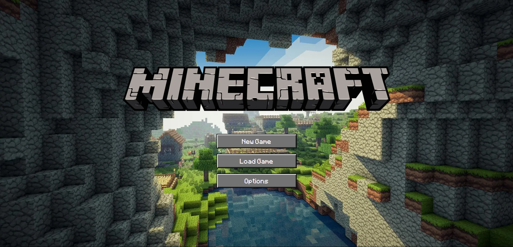

# Minicraft

Minicraft is a simplified and primitive version of Minecraft built with Next.js, TypeScript, and Three.js. The project showcases an early implementation of voxel-based terrain generation, player interaction, and block manipulation, focusing on modular and modern web development practices. Perfect for exploring the fundamentals of game development in the web ecosystem.



## 📋 Key Features

- **Infinite Terrain Generation**: Create an endless voxel-based world dynamically as the player explores, offering seamless and uninterrupted gameplay.

- **Optimized Rendering with InstancedMesh**: Leverages Three.js InstancedMesh to minimize draw calls, allowing for the efficient rendering of thousands of blocks.

- **Biome Generation with Simplex Noise**: Generate realistic and diverse biomes such as tundra, temperate zones, jungles, and deserts using simplex noise algorithms.

- **Terrain Generation with Noise**: Procedurally generate detailed and varied terrain features, including hills, valleys, and flatlands, using configurable noise parameters.

- **Interactivity with Add/Remove Blocks**: Players can interact with the world by adding or removing blocks, enabling creative construction and terrain modification.

- **Chunk-Based World Management**: Divide the world into manageable chunks for efficient memory usage and rendering, facilitating smooth gameplay.

- **Async Chunk Loading with Draw Distance**: Dynamically load and unload chunks asynchronously based on player position, showing only the visible chunks within a configurable draw distance.

- **Fog and Lighting Effects**: Enhance visual realism with fog effects and dynamic lighting, adapting to player movement and terrain features.

- **Modular and Extensible Design**: Built with modern web development tools, enabling future feature expansions and integrations.

## Built With

- [React](https://reactjs.org/)
- [NextJs](https://nextjs.org/)
- [Tailwind](https://tailwindcss.com/)
- [ThreeJs](https://threejs.org/)

## Installation

_Follow the following steps to install and setup the virtual environment._

1. Clone the repo
   ```sh
   git clone https://github.com/Samrat-14/minecraft-v2.git
   ```
2. Once inside the cloned repo, get started with installing the node modules.
   ```sh
   npm install
   ```
3. Start the server for frontend.
   ```sh
   npm run dev
   ```
4. After the installments are over and the server is running, you can get started with the project.

## Contributing

I love contributions, so please feel free to fix bugs, improve things, provide documentation.
If you have a suggestion that would make this better, please fork the repo and create a pull request. You can also simply open an issue with the tag "enhancement".
Don't forget to give the project a star! Thanks again!

1. Fork the Project
2. Create your Feature Branch (`git checkout -b feature/AmazingFeature`)
3. Commit your Changes (`git commit -m 'Add some AmazingFeature'`)
4. Push to the Branch (`git push origin feature/AmazingFeature`)

## 🪪 License

Distributed under the MIT License. See `LICENSE` for more information.

## 🌎 View Demo

Live Demo: [https://samrat-minecraft.vercel.app/](https://samrat-minecraft.vercel.app)

## 📞 Contact

Your Name - [Samrat Sadhu](https://samrat-sadhu-portfolio.vercel.app/) - ss2414@ece.jgec.ac.in
